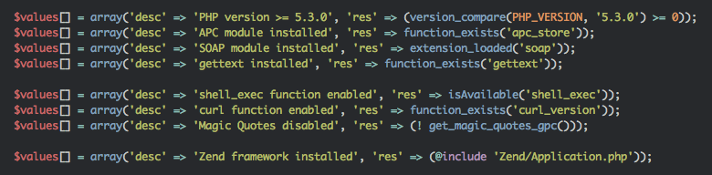
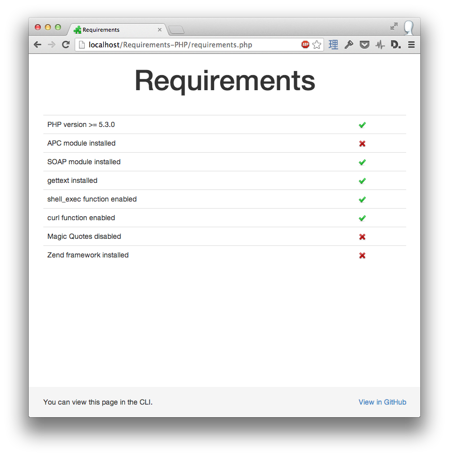
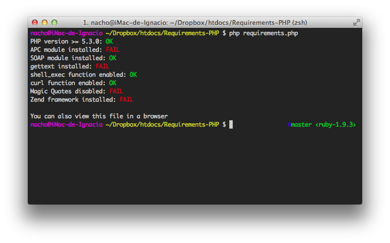

# Requirements-PHP

Configurable page to check the requirements of your PHP Application.
You can run this page in the browser or in the CLI.

## Usage

### Add your own conditions

### Run file in browser

### Also works in the CLI

## License

Released under the MIT License.